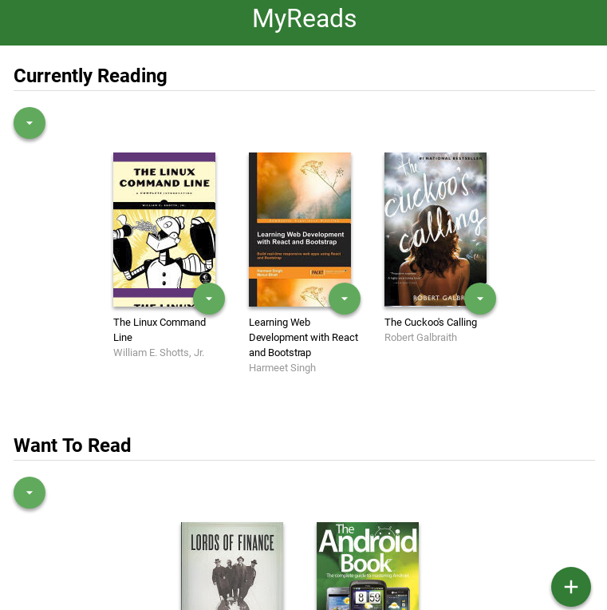
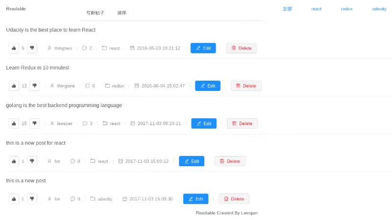
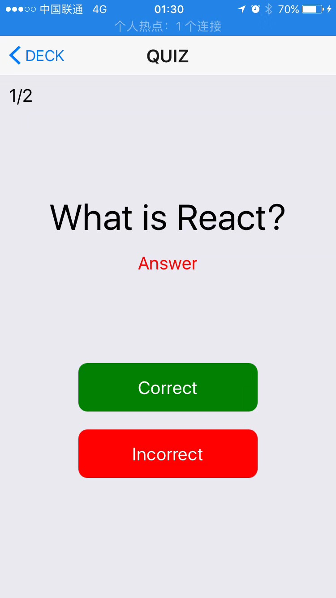
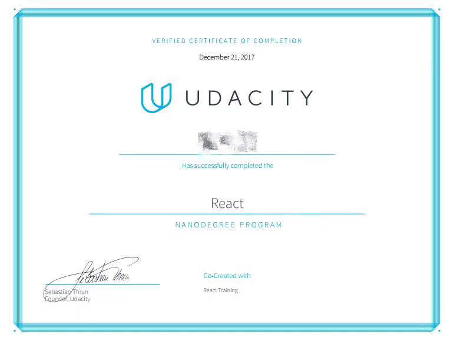

# Udacity React Developer Nanodegree

[Udacity React开发者纳米学位](http://cn.udacity.com/course/react-nanodegree--nd019-cn)

## 完成的React项目

### 1. [图书跟踪应用](https://github.com/leesper/become-frontend-developer/tree/master/P9_MyReads)

“图书跟踪应用”是基于ReactJS+React-Router开发的Web应用，用户可以通过该应用管理自己“已读”，“正在读”和“想读”的书籍，并可以搜索添加新书。本人负责整个项目的编写。我首先快速学习了React相关的知识，查阅文档，特别是“Thinking in React”。然后将应用分为两个页面：图书列表页面和书籍搜索页面，利用盒子模型细分页面然后将各基础元素组件化，分别开发各个组件，然后再组合起来形成完整页面。在此基础上对应用需要管理的状态进行建模，抽象出业务模型并独立出来形成一个模块。这些工作都做完后，开始正式添加交互功能，通过componentDidMount()生命周期函数请求服务端数据并更新状态重新渲染页面，为用户选择下拉列表项增加回调函数，处理书籍类别的变化，添加以及删除操作。在完成全部需求的基础上，我还扩展了应用功能，增加了批量移动书籍的功能，最后调试测试，修复bug并提交。通过该项目，我锻炼了自己使用ReactJS进行Web开发的能力。

### 2. [Readable论坛](https://github.com/leesper/become-react-developer/tree/master/P2_Readable)

Readable是基于ReactJS+Redux开发的匿名内容和评论Web应用，用户可以在论坛上发布不同类别的帖子，添加评论，并给帖子或者评论评分。本人负责整个项目的开发。我首先阅读项目提供的服务端node.js代码，然后根据提供的服务编写API接口，包括获取类别，获取帖子，添加新帖子，添加新评论等等功能。然后根据需求设计了论坛需要维护的状态树，包括类别，帖子，评论和是否可编辑等等。在此基础上编写actions和reducers，再把它们combine起来。最后，做Presentation层的开发，这里我使用了antd这个组件式UI库，先把界面原型做出来，确定需要传入的props，最后开发容器组件，将状态和界面连接起来，在项目原有要求的基础上，我增加了按照类别进行排序的功能。通过完成该项目，我掌握了使用Redux管理应用程序状态的基本技能，提高自己的React开发能力。

### 3. [手机单词卡](https://github.com/leesper/become-react-developer/tree/master/P3_UdaciCards)

“手机单词卡”是基于React Native+Navigation+Redux开发的Native App，可以运行在安卓和苹果设备上。用户可以添加卡片问题和答案，参与答题并查看自己的得分。本人负责整个项目的开发工作，为了完成该项目，我首先开发了各主要的界面，用TabNavigator和StackNavigator把它们连接起来，先看看界面效果。然后在此基础上编写界面之间的跳转逻辑，并确定各页面之间要传递的参数。然后设计应用程序要维护的状态，并编写相应的actions和reducers。最后我使用redux-persist库将redux维护的状态持久化到AsyncStorage中，这样就能够保存用户添加的问题卡片信息。通过完成该项目，我练习了使用ReactJS框架开发原生App应用的能力。

## React开发者纳米学位证书

